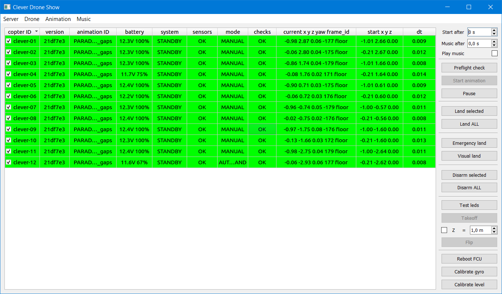
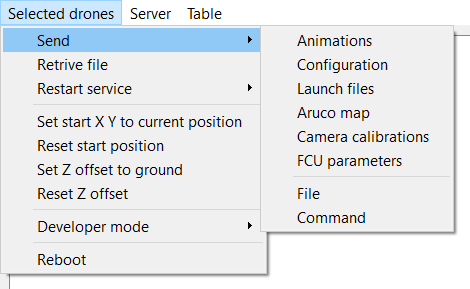
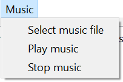
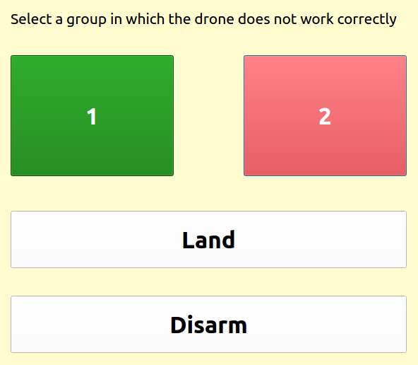

# Сервер

Приложение для создания и запуска шоу, настройки дронов, анимации и музыки.

* [Установка и запуск](start-tutorial.md#установка-и-запуск-сервера)
* [Интерфейс](#интерфейс-сервера)
* [Настройка](#настройка-сервера)
* [Дополнительные операции](#дополнительные-операции)

[TOC]

## Интерфейс сервера

Сервер имеет визуальный графический интерфейс для удобства взаимодействия.



### Таблица состояния коптеров

При первом подключении клиента к серверу в таблицу добавляется строка для отображения состояния клиента, содержащая только имя клиента (`copter ID`). Если на клиентах настроена автоматическая передача телеметрии, данные в таблице будут обновляться автоматически. Так же возможно запросить телеметрию выбранных клиентов с помощью кнопки [`Preflight check`](#управление) Строки можно сортировать по возрастанию или убыванию значений любого из столбцов, кликнув по его заголовку.

Ячейки таблицы подсвечиваются:

* жёлтым, если необходимое значение отсутствует
* красным, если данные в ячейке не прошли проверку
* зелёным, если данные в ячейке прошли проверку

Коптер считается **готовым к воспроизведению анимации**, если все ячейки в строке прошли проверку и подсвечены зелёным.

Коптер считается **готовым к полёту**, если все ячейки в строке, кроме `animation ID` и `dt`, прошли проверку и подсвечены зелёным.

#### Столбцы таблицы

* `copter ID` - имя клиента. Может быть сконфигурирован на стороне клиента. Отображается сразу при подключении клиента. Рядом с каждым ID коптера расположен чекбокс - коптеры, чей ID отмечен чекбоксом положительно (галочка), считаются *выбранными*. Ячейки в этом столбце всегда проходят проверку.
  * При двойном нажатии на это поле можно ввести новый `copter ID` клиента и переименовать его. В качестве имени допустимы сочетания латинских букв, цифр и тире (A-Z, a-z, 0-9, '-') длинной не более 63 символов. Тире не может являться первым символом. 
* `version` - хеш-код текущей git версии клиента. Ячейки в этом столбце проверяются при включенном (значение `true`) параметре [check_git_version](#раздел-checks), задаваемом в настройках сервера. Ячейка в данном столбце проходит проверку если хеш-код git версии данного клиента и сервера совпадают (если сервер не расположен в git-репозитории, то проверка проходится автоматически).
* `configuration` - заданная пользователем версия конфигурации клиента. Ячейки в этом столбце всегда проходят проверку.
  * Ячейки этого столбца поддерживают *drag-and-drop*. При перетаскивании ячейки в любое стороннее приложение, поддерживающее файлы (к примеру, "Проводник"), файл конфигурации клиента будет скопирован в указанное место. При перетаскивании ячейки на другую ячейку файл конфигурации будет скопирован с одного на другой. При перетаскивании файла на ячейку он будет записан на клиент в качестве конфигурации (при условии валидации). При передаче конфигурации на клиент секция `PRIVATE` не будет отправляться.
* `animation ID` - внутреннее название файла анимации, подгруженного клиентом. Ячейка в данном столбце не проходит проверку, если анимация отсутствует (значение `No animation`). В остальных случаях, если ячейка не пустая, она проходит проверку. **Внимание!** Проверьте соответствие названий файлов анимаций у коптеров перед запуском.
* `battery` - значение напряжения на аккумуляторе коптера в вольтах и заряд в процентах по данным полётного контроллера. Ячейка в данном столбце проходит проверку, если значение заряда батареи выше значения [battery_percentage_min](#раздел-checks), задаваемого в настройках сервера. В остальных случаях, если ячейка не пустая, она не проходит проверку.
* `system` - состояние полётного контроллера. Ячейка в данном столбце проходит проверку, если её значение `STANDBY`. В остальных случаях, если ячейка не пустая, она не проходит проверку.
* `sensors` - состояние калибровки компаса, акселлерометра и гироскопа полётного контроллера. Ячейка в данном столбце проходит проверку, если её значение `OK`. В остальных случаях, если ячейка не пустая, она не проходит проверку.
* `mode` - режим полётного контроллера. Ячейка в данном столбце не проходит проверку, если её значение `NO_FCU` или содержит `CMODE`. В остальных случаях, если ячейка не пустая, она проходит проверку.
* `checks`  - состояние самодиагностики коптера. Ячейка в данном столбце проходит проверку, если её значение `OK`. В остальных случаях, если ячейка не пустая, она не проходит проверку.
  * При двойном клике на ячейку при наличии ошибок будет показано диалоговое окно с полной детализацией всех ошибок.
* `current x y z yaw frame_id` - текущее положение коптера с указанием названия системы координат. Ячейка автоматически проходит проверку если у параметра [check_current_position ](#раздел-checks) установлено значение `false`. Иначе, ячейка в данном столбце не проходит проверку, если её значение `NO_POS` или содержит `nan`. В остальных случаях, если ячейка не пустая, она проходит проверку.
* `start x y z` - стартовое положение коптера для воспроизведения анимации. Ячейка в данном столбце не проходит проверку, если её значение `NO_POS` или разница между текущим и стартовым положением коптера больше значения [start_pos_delta_max](#раздел-checks). В остальных случаях, если ячейка не пустая, она проходит проверку.
* `dt` - разница между временем на сервере и клиенте в секундах, включая сетевую задержку. Ячейка в данном столбце проходит проверку, если её значение меньше значения [time_delta_max](#раздел-checks), задаваемого в настройках сервера. В остальных случаях, если ячейка не пустая, она не проходит проверку. При слишком больших значениях сигнализирует об отсутствии синхронизации времени между коптером и клиентом.

### Меню

#### Раздел Selected drones



Данный раздел содержит несколько утилит по отправке различных данных и команд на *выбранные* клиенты. **Внимание!** Не используйте данные команды во время полёта коптеров!

- ##### Подраздел Send

  - `Animations` - отправка файлов анимации, экспортированных аддоном к Blender, на выбранные коптеры. В диалоговом окне необходимо выбрать *папку*, содержащую файлы анимации. Каждый файл анимации будет отправлен на клиент с именем, соответствующим имени файла без расширения.

  - `Configuration` - отправка *единого* файла конфигурации клиента на все выбранные клиенты. В диалоговом окне необходимо выбрать *один* файл конфигурации в установленном формате. Файл конфигурации может быть неполным, в таком случае будут перезаписаны лишь указанные в файле параметры. **Внимание!** Не рекомендуется использовать данное действие для массовой перезаписи `copter ID`, кроме значения `/hostname`. **Внимание!** НЕ отправляйте на клиенты файл конфигурации сервера.

  - `Launch files` - отправка launch-файлов конфигурации сервиса `clever`. В диалоговом окне необходимо выбрать *папку*, содержащую файлы конфигурации с сширением `.launch`. Все файлы с таким расширением будут отправлены *на каждый* из клиентов. **Внимание!** Существующие файлы конфигурации на коптерах будут перезаписаны, однако файлы, не отправленные сервером, не будут удалены или модифицированы.

  - `Aruco map` - отправка *единого* файла карты aruco маркеров на все выбранные клиенты. В диалоговом окне необходимо выбрать *один* файл карты в установленном формате. Файл на клиенте будет перезаписан. После получения и записи файла клиент автоматически перезапустит сервис `clever`. Для возобновления работоспособности полётных функций и получения некоторых значений телеметрии *необходимо подождать* некоторое время до полного запуска сервиса.

  - `Camera calibrations` - отправка yaml-файлов калибровки камеры для сервиса `clever`.  В диалоговом окне необходимо выбрать *папку*, содержащую файлы конфигурации с расширением `.yaml`. Каждый файл калибровки будет отправлен на клиент с именем (copter ID), соответствующим имени файла без расширения. **Внимание!** Существующий файл калибровки на коптере будет перезаписан.

  - `FCU parameters` - отправка и запись *единого* файла конфигураций полётного контроллера (FCU) на все выбранные клиенты. В диалоговом окне необходимо выбрать *один* файл параметров в установленном формате. Параметры на полётном контроллере  будут перезаписаны.

  - `File` - отправка *одного* любого файла на все выбранные клиенты. В диалоговом окне необходимо выбрать *один* файл. Далее, необходимо указать путь, по которому данный файл будет записан на клиенты (не включая имя файла).

  - `Command` - отправка и выполнение любой команды терминала на все выбранные клиенты. В диалоговом окне необходимо ввести требуемую команду. Команды *могут* использовать `sudo`-права.

    ------

- `Retrive file` - позволяет скачать любой файл с клиентов в выбранную директорию в файловой системе сервера. Если при скачивании был выбран более чем один клиент, то к имени файла от каждого клиента будет добавлен его ID. В диалоговом окне сначала введите путь к требуемому файлу на клиенте.  Далее, в диалоговом окне необходимо указать путь, по которому данный файл будет записан на сервер.

  ------

- ##### Подраздел Restart

  

  * `chrony` - перезапускает сервис синхронизации времени `chrony` на выбранных клиентах. Используйте для ручной синхронизации в случаях, если время между сервером и клиентами не синхронизировано.
  * `clever` - перезапускает сервис  `clever` на выбранных клиентах. Для возобновления работоспособности полётных функций и получения некоторых значений телеметрии *необходимо подождать* некоторое время до полного запуска сервиса.
  * `clever-show` - перезапускает сервис шоу коптеров `clever-show` на выбранных клиентах. Во время перезапуска клиенты будут отключены.

- ------

  `Set start X Y to current position` - устанавливает точку старта анимации у выбранных клиентов в значения текущей позиции по X Y.

- `Reset start position` - устанавливает точку старта анимации у выбранных клиентов в значения `0.0`, `0.0`.

* `Set Z offfset to ground` - устанавливает собственный отступ по Z каждого из выбранных клиентов в значение, равное текущему положению по координате Z. Можно применять для выравнимания общей высоты полёта коптеров.
* `Reset Z offfset` - устанавливает собственный отступ по Z каждого из выбранных клиентов в значение `0`.
* `Developer mode`: **Внимание!** Используйте данные действия с большой осторожностью.
  * `Update clever-show git` - обновляет папку репозитория  `clever-show` на выбранных клиентах. Файлы конфигурации клиента *не будут* перезаписаны. **Внимание!**  Для того, чтобы изменения вступили в силу, *необходимо* перезапустить сервис `clever-show`.
* `Reboot` - полностью перезагружает полётный контроллер и компьютер на выбранных коптерах. Во время перезапуска клиенты будут отключены.

#### Раздел Server

- ##### Подраздел Music

  

  - `Select music file` - загружает выбранный музыкальный файл для дальнейшего воспроизведения вручную или через определённое время после старта анимации. Поддерживаемые расширения: `.mp3` или `.wav`.
  - `Play music` - воспроизводит загруженную музыку.
  - `Stop music` - останавливает воспроизведение проигрываемой музыки.

- ------

  `Edit server config`  - открывает [встроенный редактор конфигурационных файлов](#config-editor) с текущей конфигурацией сервера для редактирования. Доступен чекбокс `Restart` - в случае, если он нажат, то при сохранении конфигурации сервер будет перезапущен. **Внимание!** Изменённые параметры конфигурации будут применены к серверу только после его перезапуска (ручного или автоматического).

- `Edit any config` - открывает [встроенный редактор конфигурационных файлов](#config-editor) и позволяет выбрать для редактирования в файловой системе любой файл конфигурации c расширением `.ini` или же открыть файл спецификации конфигурации для создания файла конфигурации на его основе.

- `Restart server` - полностью перезапускает сервер. **Внимание!** После перезапуска сервер более не будет соединён с консолью, из которой был запущен, если сервер изначально был запущен из консоли.

#### Раздел Table


- `Toggle select` (`Ctrl+A`) - выделят все коптеры\снимает выделение со всех коптеров. Если в таблице выбраны не все коптеры, то *выделяет все* коптеры. Иначе (если были выделены все коптеры) *снимает выделение* со всех коптеров.
- `Select all` - выделят все коптеры в таблице.
- `Deselect all` - снимает выделение со всех коптеров в таблице.
- `Remove selected drones` - удаляет выбранные коптеры из таблицы. **Внимание!** В случае, если клиент был подключен, будет произведено отключение. В случае если удалённый таким образом клиент исправно функционировал, он переподключится в кратчайшие сроки.
- `Configure columns` - открывает [встроенный конфигуратор](#column-preset-editor) наборов настроек столбцов таблицы.

### Боковая панель команд


#### Управление

Данный раздел команд предназначен для выскоуровневого управления роем дронов.

* Спинбокс `Start after` - задаёт время задержки синхронного запуска выполнения анимаций коптерами после нажатия на кнопку `Start animation`. Для загруженных, подверженных помехам или имеющих большой пинг сетей рекомендуется использовать значения больше нуля.
* Спинбокс `Music after` - задаёт время задержки запуска музыки после нажатия на кнопку `Start animation`.
* Чекбокс `Play music` - определяет, будет ли воспроизведена музыка при запуске анимации.
* Кнопка `Preflight check` - все выбранные клиенты выполняют самодиагностику и предполётную проверку. Результаты, вместе с другими параметрами клиента, будут отображены в таблице по мере поступления данных. Необходима в том случае, если на клиенте не настроена автоматическая передача телеметрии.
* Кнопка `Start animation` - посылает время старта анимации на все выбранные коптеры с учётом заданного в спинбоксе `Start after` времени. Все выбранные коптеры начинают синхронное воспроизведение анимации после нажатия на данную кнопку и через время, заданное в спинбоксе `Start after`. По окончанию анимации все коптеры выполнят посадку на месте окончания своей анимации. Кнопка активна только в том случае, если все коптеры готовы к воспроизведению анимации. При нажатии запрашивается дополнительное предупреждение.
* Кнопка `Pause/Resume` - ставит на паузу и возобновляет выполнение полётных задач. После каждого нажатия кнопка меняет состояние на обратное.
  * Состояние`Pause` - ставит на паузу очередь заданий всех выбранных коптеров: приостанавливается выполнение любого полётного задания. Рекомендуется использовать в чрезвычайных ситуациях для определения неисправного коптера. **Внимание!** Данная команда НЕ прерывает полёт коптера в уже указанную точку (например: элементы взлёта, посадки; следование до начальной точки анимации и т.д.)
  * Состояние `Resume` - все выбранные коптеры *синхронизированно* продолжат выполнение своих очередей заданий (например исполнение анимации)

#### Средства перехвата в экстренных ситуациях

* Кнопка `Land selected` - все выбранные коптеры прекращают выполнение своих полётных заданий, очищают очередь заданий и немедленно переходят в режим посадки AUTO.LAND. **Используйте в экстренных случаях как одно из средств перехвата.**
* Кнопка `Land ALL` - ВСЕ коптеры прекращают выполнение своих полётных заданий, очищают очередь заданий и немедленно переходят в режим посадки AUTO.LAND. **Используйте в экстренных случаях как одно из средств перехвата.**

* Кнопка `Emergency land` - все выбранные коптеры прекращают выполнение своих полётных заданий, очищают очередь заданий и немедленно переходят в режим экстренной посадки - на все моторы подаётся небольшая мощность, которая уменьшается через определённое время до нуля. **Используйте в экстренных случаях как одно из средств перехвата.**
* Кнопка `Visual land` - открывает [диалоговое окно](#visual-land) модуля визуальной посадки неисправного коптера.

* Кнопка `Disarm selected` - все выбранные коптеры прекращают выполнение своих полётных заданий, очищают очередь заданий и немедленно отключают моторы. Это может привести к падению и повреждению коптеров.
* Кнопка `Disarm ALL` - ВСЕ коптеры прекращают выполнение своих полётных заданий, очищают очередь заданий и немедленно отключают моторы. Это может привести к падению и повреждению коптеров **Используйте в крайних случаях как последнее из средств перехвата.**

#### Тестовые команды

В данном разделе находятся команды, позволяющие напрямую управлять коптерами для их проверки.

* Кнопка `Test leds` - все выбранные коптеры выполняют двухсекундную анимацию (бегущие точки) светодиодной лентой (белым цветом). Команда *безопасна* и может быть использована для проверки работы светодиодных лент, качества и задержки подключения к серверу или определения соответствия коптера и его `copter ID` в таблице.
* Кнопка `Takeoff` - все выбранные коптеры совершают вертикальный взлёт, после чего зависают над точкой взлёта. Кнопка активна, *только* если все выбранные коптеры готовы к полёту. **Внимание!** Используйте осторожно, соблюдайте технику безопасности. Не применяйте во время выполнения других полётных функций!
  * Чекбокс `Z` - если чекбокс активен, коптер взлетит в указанное значение по `z`. Иначе коптерами будут использоваться значения по умолчанию, указанные в их конфигурациях, а взлёт будет производиться относительно текущей высоты.
  * Спинбокс `Z` - задаёт значение координаты `z` взлёта коптеров в метрах.
* Кнопка `Flip` - все выбранные коптеры **совершают флип (flip)** - переворот на 360 градусов вокруг одной из *горизонтальных* осей. **Внимание!** Используйте осторожно, соблюдайте технику безопасности. **Внимание!** Для исполнения флипа коптер должен иметь минимальную высоту больше 2м. **Внимание!** Не применяйте во время выполнения других полётных функций!

#### Системные команды

В данном разделе находятся команды, исполняемые непосредственно на полётном контроллере коптера.

* Кнопка `Reboot FCU` - перезагружает полётные контроллеры всех выбранных коптеров. Можно использовать для обновления поворота коптера при его определении только с помощью инерциальной системы коптера, например при полёте по системе позиционирования Pozyx или с помощью Optical Flow. Для возобновления работоспособности полётных функций и получения некоторых значений телеметрии *необходимо подождать* некоторое время до перезагрузки полётного контроллера.
* Кнопка `Calibrate gyro` - переводит полётные контроллеры всех выбранных коптеров в режим калибровки гироскопа. **Внимание!** Коптеры должны быть неподвижны в течение калибровки.
* Кнопка `Calibrate level` -  переводит полётные контроллеры всех выбранных коптеров в режим калибровки уровня горизонта. **Внимание!** Коптеры должны быть неподвижны в течение калибровки.

## Настройка сервера

### Файл конфигурации

Конфигурация сервера задаётся в файле [server.ini](../../Server/config/server.ini), имеющем следующий вид по умолчанию:

```ini
# This is generated config with default values
# Modify to configure
config_name = server
config_version = 1.0

[SERVER]
    port = 25000
    buffer_size = 1024

[TABLE]
    # True  -> clients are removed on disconnection
    # False -> disconnected clients indicated
    remove_disconnected = False
    [[PRESETS]]
        current = DEFAULT
        [[[DEFAULT]]]
            copter_id = True, 100
            git_version = True, 75
            config_version = True, 140
            animation_id = True, 100
            battery = True, 100
            fcu_status = True, 100
            calibration_status = True, 65
            mode = True, 100
            selfcheck = True, 65
            current_position = True, 250
            start_position = True, 150
            last_task = True, 250
            time_delta = True, 241

[CHECKS]
	check_git_version = True
    check_current_position = True
    # in percents; set 0 to disable this check
    battery_min = 50.0
    # in meters; set 0 to disable this check
    start_pos_delta_max = 1.0
    # in seconds
    time_delta_max = 1.0
    
[BROADCAST]
    send = True
    listen = True
    port = 8181
    # delay for message sending in seconds
    delay = 5.0

[NTP]
    use = False
    host = ntp1.stratum2.ru
    port = 123
```

Данный файл конфигурации автоматически генерируется при первом запуске сервера, если отсутствует файл конфигурации. Пользовательский файл может содержать неполный набор параметров - в этом случае будут использоваться значения по умолчанию для отсутствующих параметров. Конфигурация по умолчанию является полностью работоспособной и не требует изменений для быстрого начала работы системы.

#### Корневой раздел

- `config_name` - Произвольная строка, название файла конфигурации для удобства хранения и быстрого отличия одного файла конфигурации от другого.
- `config_version` - Произвольное дробное число, версия файла конфигурации для удобства хранения и быстрого отличия одного файла конфигурации от другого.

#### Раздел SERVER

В этом разделе задаются параметры сетевого взаимодействия сервера. Доступны следующие параметры:

* `port` - TCP порт, на который будут приниматься входящие соединения от клиентов. При использовании broadcast данный порт будет сконфигурирован у клиента автоматически. *Рекомендуется изменить значение по умолчанию в целях безопасности* (любое пятизначное и более число, если другое ПО не использует выбранный порт).
* `buffer_size` - размер буфера при приёме и передаче данных. *Не рекомендуется изменять. Рекомендуется использовать единое значение у сервера и клиентов.*

#### Раздел TABLE

* `remove_disconnected` - Определяет поведение при разрыве связи с клиентом. При значении `True` вся информация о клиенте *будет удалена* как из внутренней памяти, так и *из таблицы*. *Это может привести к 'скачкам' таблицы при отключении клиентов.* При значении `False` отключённые клиенты *не будут* удалены из таблицы, но будут отображены с подсвечиванием ячейки в столбце `copter ID` красным цветом. Все данные будут сохранены. При переподключении клиента, он будет ассоциирован с той же строкой таблицы, а ячейка со значением `copter ID` вновь станет зелёного цвета.

##### Подраздел PRESETS

Не рекомендуется изменять данный раздел вручную - для редактирования данных параметров можно взаимодействовать с таблицей или используя встроенный диалог конфигурации таблицы.

* `current` - Название текущего выбранного набора настроек столбцов таблицы
* `<название_набора>`
  * `<название_столбца>` - значение представляет собой список (через ",") из булевого значения (отображается ли столбец в таблице) и целого числа больше 0 (ширину столбца в пикселах)

#### Раздел CHECKS

В этом разделе задаются параметры проверок коптера, которые регулируются на стороне сервера. Доступны следующие параметры:

- `check_git_version` - Будет ли производиться проверка соответствия git-версий клиента и сервера для индикации в ячейках столбца `version`
- `check_current_position` - Будет ли производиться проверка корректности текущих координат коптера для индикации в ячейках столбца `current x y z yaw frame_id`.

* `battery_percentage_min` - Минимальный заряд батарии коптера, допустимый для взлёта. Указывается *в процентах* (дробное значение от 0 до 100). Значение меньше указанного будет отмечено в столбце `battery` как неудовлетворительное.
* `start_pos_delta_max` - Максимальное расстояние от текущего положения коптера до его точки взлёта в файле анимации, допустимое для взлёта. Указывается *в метрах* (дробное значение от 0 до 'inf'). Значение больше указанного будет отмечено в столбце `start x y z` как неудовлетворительное. Допустимо использование строки 'inf' для любого допустимого расстояния.
* `time_delta_max` - Максимальная разница (абсолютное значение) между временем сервера и клиента (включая сетевую задержку), допустимая для взлёта. Указывается *в секундах* (дробное значение от 0 до 'inf'). Значение больше указанного будет отмечено в столбце `dt` как неудовлетворительное.

#### Раздел BROADCAST

Сервер может использовать UDP broadcast, чтобы передавать клиентам актуальную информацию о конфигурации сервера. Таким образом становится возможным автоматическое подключение клиентов к серверу без необходимости дополнительной ручной конфигурации. В данном разделе задаются параметры этого механизма:

* `send` - будут ли использованы broadcast'ы для передачи данных (при значении `False` broadcast'ы НЕ будут отправляться). Используйте `False` в случае повышенных требований безопасности, перегруженности сети или невозможности передачи по широковещательному каналу (из-за конфигурации брандмауэра или сети)
* `listen` - будет ли сервер прослушивать порт бродкастов для автоматического выключения во избежание наличия нескольких серверов в одной сети. 
* `port` - UDP порт, по которому будет осуществляться отправка сообщений. *Рекомендуется изменить значение по умолчанию в целях безопасности.* **Внимание!** При изменении этого параметра клиенты НЕ смогут принимать сообщения автоконфигурации до изменения (вручную) соответствующего параметра в конфигурации клиента на равное значение.
* `delay` - периодичность (в секундах, дробное значение), с которой будет происходить отправка broadcast сообщений. Увеличьте задержку для уменьшения нагрузки на сеть. Уменьшите задержку для уменьшения времени отклика и подключения при первом запуске клиентов.

#### Раздел NTP

Помимо синхронизации времени (с миллисекундной точностью) с помощью пакета chrony, предоставляется альтернатива - возможность использования внешних (при наличии соединения локальной сети с интернетом) или внутрисетевых NTP-серверов. **Внимание!** Для корректной работы системы, **и сервер, и клиенты** должны использовать единый способ синхронизации времени (набор параметров в этом разделе). Данный раздел полностью унифицирован и для сервера, и для клиентов.

* `use` - определяет, будет ли использоваться синхронизация времени с помощью NTP. (при значении `False` будет использовано локальное время ОС (синхронизируется автоматически при использовании chrony). *Рекомендуется использование chrony, а не NTP*
* `host` - имя хоста или IP адрес NTP сервера (локального или удаленного)
* `port` - порт, используемый NTP сервером

## Дополнительные операции и окна

### Visual land

Модуль визуальной экстренной посадки, предназначенный для быстрого поиска оператором визуально неисправного коптера методом бинарного поиска. Для успешного применения на всех коптерах должна быть установлена светодиодная лента.

#### Интерфейс



При нажатии на кнопку `Visual land` все коптеры делятся на 2 равные группы по порядку расположения в таблице. Первая половина коптеров зажигает светодиодную ленту зелёным цветом, вторая - красным. При нажатии на зелёную или красную кнопку происходит выбор группы, соответствующей цвету нажатой кнопки. Коптеры выбранного цвета снова делятся на две половины и каждая половина зажигает светодиодную ленту зелёным и красным цветом соответственно. Остальные коптеры выключают светодиодную ленту.

Нажимая на кнопки, соответствующие цвету группы, в которой находится неисправный коптер, можно определить его номер и выполнить экстренную посадку за логарифмическое количество шагов от количества коптеров, т.е. гораздо быстрее, чем перебирая коптеры по одному.

На любом шаге можно произвести посадку или выключение моторов всех коптеров, на которых включена светодиодная лента, нажав кнопку `Land` или `Disarm`.

### Config editor

...

### Column preset editor

...